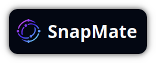
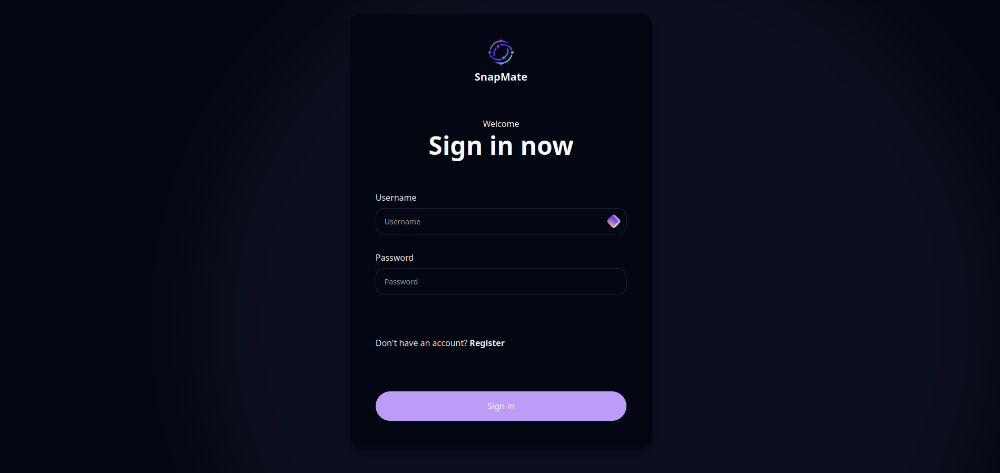
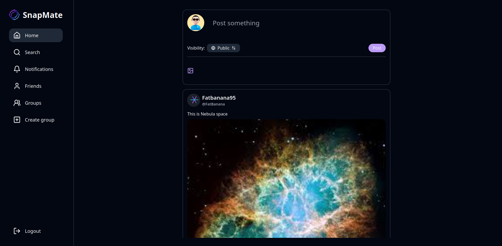
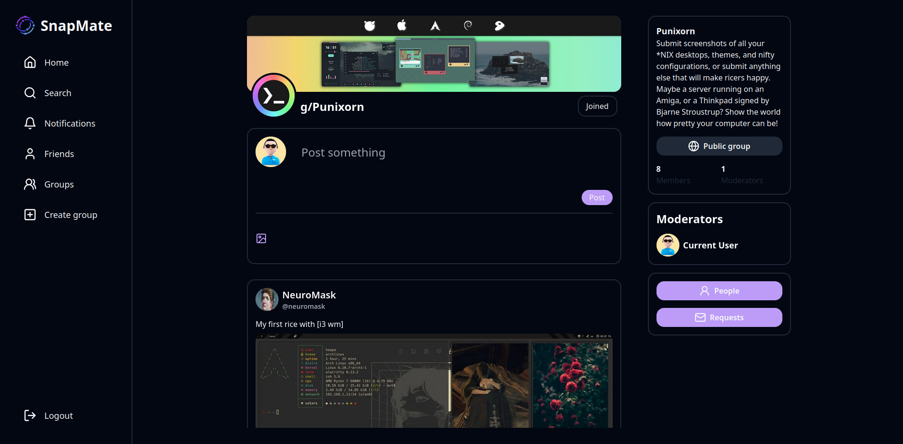
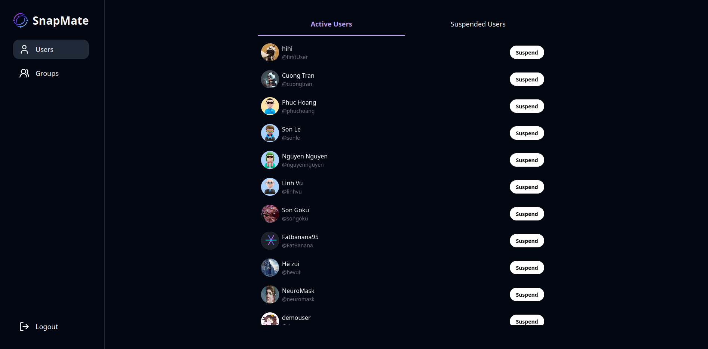

<p align="center" >
  <a name="header"></a>
  
</p>

<h3  align="center" >
  Snapmate
</h3>

<p  align="center" >
  A social media application built on MERN stack
</p>

<h1  align="center" >
  COSC2808-Fullstack-application
</h1>

SnapMate is a social media app built with the MERN stack (MongoDB, Express, React, Node.js) as part of the COSC2808-Fullstack-application project. It lets users create and share posts, manage profiles, and connect with friends. With features like user authentication and real-time updates, SnapMate offers a smooth and modern user experience.

<p align="center" >
  
  
</p>
<p align="center" >
  
  
</p>

# 🚩 Table of contents

- [Installation](#installation)
- [Features](#features)
- [Usage](#usage)
- [Technologies](#technologies)

<a name="installation"></a>
# 🔧 Installation

To install this project, simply clone the git repository and run it

1. Clone the repository
``` bash
$ git clone https://github.com/Hankaji/COSC2808-Fullstack-application.git ./snapmate
```

2. Navigate to the project's **frontend** and **backend** and install required packages using your package manager of choice (ex. npm, yarn, pnpm & bun)
``` bash
$ cd ./snapmate/client
$ npm install

$ cd ../server
$ npm install
```

3. Run the development server on both **frontend** and **backend** 
``` bash
$ cd ../client
$ npm start

$ cd ../server
$ npm start
```

4. Configure environmental variable

Create an `.env` file in the `server/` folder and put the following content in it
``` .env
MONGO_URI=<Your mongodb database link>
```

> Note: Make sure to change the <Your mongodb database link> to desired and valid link otherwise the application's server won't run

<a name="features"></a>
# ✨ Features

- User Authentication & Authorization:
  - Secure user registration, login, and logout system.
  - Role-based access control for different user levels (e.g., regular users, admins).

- View other users' profiles and activity.

- Friend System:
  - Send and receive friend requests.
  - Accept or decline friend requests.

- Groups:
  - Create and join groups based on shared interests.
  - Manage group members and settings (e.g., group name, description).
  - Post and interact with content within group pages.

- Posts & Comments:
  - Create posts with text and media (images, videos).
  - Comment on posts to interact with other users.
  - Like and react to posts and comments.

- Get notified in real time for friend requests, likes, comments, and group invitations.

- Data Security & Privacy:
  - Encrypted passwords and secure data handling.
  - Privacy settings for posts and groups information.

<a name="usage"></a>
# ⚒ Usage

You can start using our app right away without much trouble like many other social media application. Below is a list of users created by us for testing demonstration.

> Note: These users are only available in database provided by us

| Username     | Passwords       | Admin Privilege |
| ------------ |:----------------|:---------------:|
| ***admin***  | ***admin123***  |✅|
| phuchoang    | phuchoang123    |❌|
| cuongtran    | cuongtran123    |❌|
| linhvu       | linhvu123       |❌|
| sonle        | sonle123        |❌|
| nguyennguyen | nguyennguyen123 |❌|

<a name="technologies"></a>
# 💻 Technologies

- Typescript

- Tailwindcss (styling)
- React.js

- Express.js
- Node.js
- MongoDB (Database)
- Mongoose (ODM)

---

<p align=right><a href="#header">↑ Back to top</a></p>

